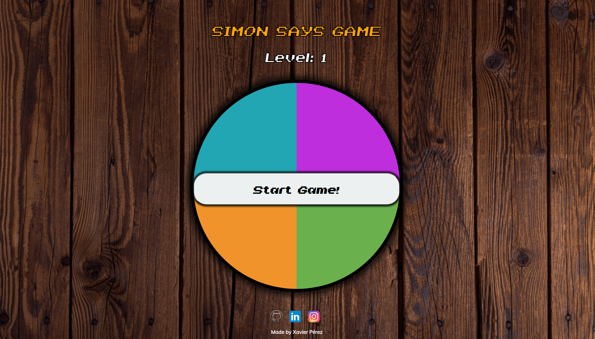

# Simon says game! 🎮

##### This is the final project from the course "JavaScript Fundamentals" by Platzi.

The project consisted on develop a "Simon says" game using HTML, CSS3 and JavaScript.

  

Concepts learned:
- Promises
- Callbacks
- OOP (Object-Oriented Programming)
- Functions
- HTML DOM events

External libraries:
- [Sweet Alert](https://sweetalert.js.org/ "Sweet Alert")

If you want to try and play, [click here!](https://xavierperez21.github.io/simon_says/ "click here!")
